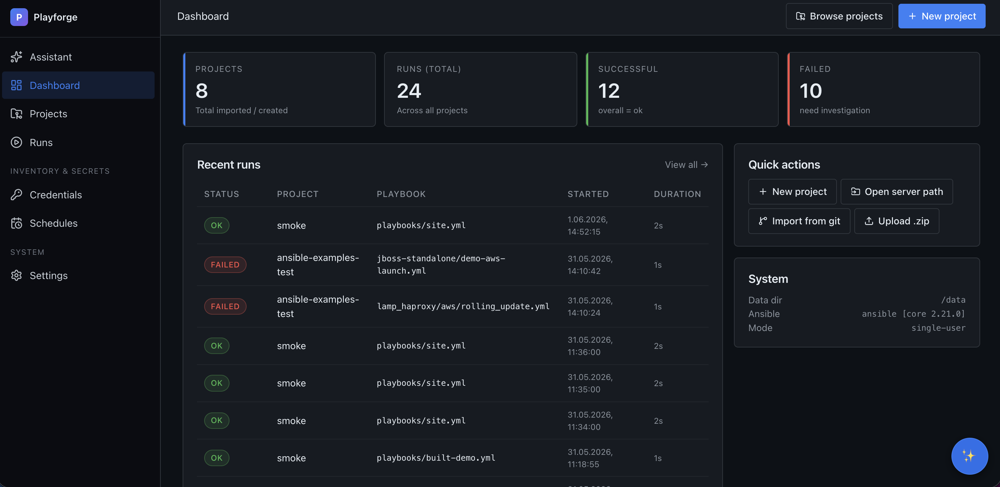

# Playforge



A self-hosted web UI for managing and running Ansible — a simpler, friendlier AWX
that runs from a single `docker compose up`, with no Postgres, Redis or Receptor.

What makes it different is the **AI layer that checks its own output**. Most tools
either don't have AI or trust it blindly. Playforge generates playbooks from plain
language, then verifies them: it flags modules that don't exist, catches logic
mistakes a model misses (SSH/UFW lockout, destructive ops, malformed `vars`), and
grounds every answer in your real modules and files — fully offline.

## Features

**Projects & runs**
- Import an existing Ansible project from a local path, a `.zip`, or `git clone`
  (Gitea/GitHub) — junk like `.venv/` and caches is filtered out automatically.
- Every project is its own git repo with an auto-commit on each save: free undo,
  diff and history. Push/pull to a remote when you want.
- Run playbooks (full or by tags) with live per-task output, a structured
  pass/fail summary, and a global, filterable run history.
- Auto-detects playbooks/inventories/roles; works with both the scaffolded layout
  and flat repos (playbook + `hosts.ini` at the root).
- Cron scheduler in-process (APScheduler — no extra worker), run templates,
  environments, ad-hoc commands.

**Secrets**
- Credentials (SSH keys, SSH passwords, vault/become passwords, WireGuard)
  encrypted at rest with Fernet.
- Ansible Vault for in-repo secrets — encrypt/decrypt/view from the UI.

**Editor & dependencies**
- Monaco editor with inline ansible-lint, per-file commit history (View / Restore
  past versions), structured inventory editing (INI + YAML).
- Playbook builder (simple → advanced: handlers, loops, `serial`, `become` per task).
- Ansible Galaxy: install/remove roles & collections by name or from `requirements.yml`.

**Operations**
- **Credential test** — probe an SSH key, SSH password, or sudo password against
  an inventory before running a 30-task playbook; per-host ✓/✗ result.
- **Ad-hoc command builder** — any module + args + host pattern in one form
  (not just "ping all").
- **`--limit` quick-pick** — click groups/hosts from the inventory to build the
  Ansible `:`-separated limit string.
- **Run artifacts** — files a run wrote into the repo are committed automatically;
  the run-detail page previews them inline or opens them in the editor.
- **Per-schedule timezone** — cron expressions interpret in any IANA timezone
  (`Europe/Warsaw`, `America/New_York`, …); next-fire times honour DST.

**✨ AI assistant (the part that's actually unique)**
- **Chat** on every page (slide-out dock) and a full page — *one shared conversation*,
  live-synced and remembered across refreshes.
- **Agent mode**: a tool-using agent that actually works on a project — it inspects
  files, writes/edits/moves them, installs collections, and can **dry-run (`--check`)
  or run** a playbook, then read the failures and fix them. It uses the
  self-checking layers below (it won't finish on a hallucinated module), every change
  is a separate git commit you can revert, and each capability is opt-in
  (read-only → "allow changes" → "allow delete / web").
- **NL → playbook**: describe what you want, get a reviewable spec + YAML.
- **Remediation loop**: after a failure, get a concrete fix and re-run only the
  failed hosts.
- **Pre-run preview**: a `--check` dry-run narrated in plain language ("what will
  change, where").
- **Auto-runbook**: living Markdown docs generated from your playbooks.
- **Self-checking layers** behind all of it:
  - *Anti-hallucination* — module names validated against `ansible-doc`
    (`ansible.builtin.ufw` → flagged as fake; `community.general.ufw` → "install
    the collection", not "doesn't exist").
  - *Rule engine* (neuro-symbolic) — catches lockout, destructive ops,
    contradictions, handler misuse, malformed structure, even inside roles.
  - *RAG / BM25* — grounds answers in the modules actually installed and in your
    project's real file contents. Works offline; optional web-fetch from
    docs.ansible.com when you allow it.

Pluggable model backends: Anthropic, OpenAI (or any OpenAI-compatible endpoint),
or a local **Ollama** server.

## Quick start

```bash
git clone https://github.com/mar0ls/playforge.git
cd playforge
cp .env.example .env   # optional — for a password, AI keys, etc.
docker compose up --build -d   # → http://127.0.0.1:8765
```

The `.env` step is optional: with no `.env` the app runs single-user/local with no
AI. Configure the AI helper under **Settings → AI helper** at runtime, or set
`OLLAMA_URL` / `ANTHROPIC_API_KEY` / `OPENAI_API_KEY` in `.env`. State (projects,
git repos, SQLite) lives under `./data` on the host and survives rebuilds.

### Optional

- **Password protection**: set `ANSIBLE_GUI_PASSWORD` to require login (signed
  session cookie). Unset = single-user local, no login.
- **Import your projects**: bind-mount their directories read-only (see the
  commented `/import/*` examples in `docker-compose.yml`).
- **Naming note**: the image and container are `playforge`; environment variables
  keep the `ANSIBLE_GUI_*` prefix for backward compatibility.

## Development

```bash
make build      # build the image
make test       # run the full suite inside the image (git + ansible available)
make up / down  # start / stop
```

For live code reload while developing, layer the dev override (bind-mounts
`backend/app` and runs uvicorn with `--reload`):

```bash
docker compose -f docker-compose.yml -f docker-compose.dev.yml up --build
```

The container exposes `GET /health` (DB ping included). The base compose wires
a Docker healthcheck against it, so `docker ps` shows `(healthy)` once the
service is up.

### Lab regression (one command)

Run a full API-level regression for a dockerized VM lab (preflight + multiple
playbook runs + JSON report suitable for CI):

```bash
PROJECT_ID=<your_project_id> make lab-regression
```

Optional knobs:

```bash
PROJECT_ID=<id> \
BASE_URL=http://127.0.0.1:8765 \
INVENTORY_PATH=inventories/lab.ini \
HOST_PATTERN=all \
CHECK_PREFLIGHT=true \
INCLUDE_TARGETS_PREFLIGHT=true \
REQUEST_TIMEOUT_SEC=600 \
PLAYBOOKS_CSV=playbooks/lab_ping.yml,playbooks/lab_file.yml,playbooks/lab_apt.yml \
EXTRA_VARS_JSON='{"some_var":"value"}' \
make lab-regression
```

The command exits non-zero when preflight fails or any run is not `ok`/
`successful`.

The test suite (370+ cases) runs in CI on every push and PR — see
`.github/workflows/ci.yml`.

## Design notes

- **Air-gap friendly**: core UI JS libraries are vendored locally and AI can run
  against a local Ollama. By default, online docs lookup is off. Note: the Monaco
  editor assets are loaded from jsDelivr unless you vendor Monaco yourself.
- **No heavy infra**: SQLite (WAL mode), in-process scheduler, direct runner.
  One container.
- Third-party components are listed in [THIRD_PARTY_LICENSES.md](THIRD_PARTY_LICENSES.md).

## License

Copyright (C) 2026 mar0ls. Playforge is licensed under the **GNU General Public
License v3.0** — see [LICENSE](LICENSE). GPL-3.0 keeps the project compatible with
its core dependencies (`ansible-core`, `ansible-runner`, `ansible-lint`), which are
GPL-3.0 themselves. Forks and redistributed versions must stay open-source under
the same license.
