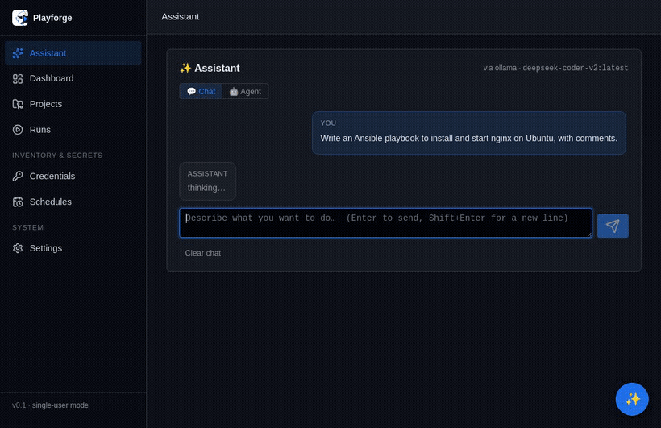

[](https://github.com/mar0ls/playforge/actions/workflows/ci.yml) [](https://codecov.io/gh/mar0ls/playforge)

# Playforge



A self-hosted web UI for managing and running Ansible — a simpler, friendlier AWX
that runs from a single `docker compose up`, with no Postgres, Redis or Receptor.

What makes it different is the **AI layer that checks its own output**. Most tools
either don't have AI or trust it blindly. Playforge generates playbooks from plain
language, then verifies them: it flags modules that don't exist, catches logic
mistakes a model misses (SSH/UFW lockout, destructive ops, malformed `vars`), and
grounds every answer in your real modules and files — fully offline.

## Features

**Projects & runs**
- Import an existing Ansible project from a local path, a `.zip`, or `git clone`
  (Gitea/GitHub) — junk like `.venv/` and caches is filtered out automatically.
- Every project is its own git repo with an auto-commit on each save: free undo,
  diff and history. Push/pull to a remote when you want.
- Run playbooks (full or by tags) with live per-task output, a structured
  pass/fail summary, and a global, filterable run history.
- Auto-detects playbooks/inventories/roles; works with both the scaffolded layout
  and flat repos (playbook + `hosts.ini` at the root).
- Cron scheduler in-process (APScheduler — no extra worker), run templates,
  environments, ad-hoc commands.

**Secrets**
- Credentials (SSH keys, SSH passwords, vault/become passwords, WireGuard)
  encrypted at rest with Fernet.
- Ansible Vault for in-repo secrets — encrypt/decrypt/view from the UI.

**Editor & dependencies**
- Monaco editor with inline ansible-lint, per-file commit history (View / Restore
  past versions), structured inventory editing (INI + YAML).
- Playbook builder (simple → advanced: handlers, loops, `serial`, `become` per task).
- Ansible Galaxy: install/remove roles & collections by name or from `requirements.yml`.

**Operations**
- **Credential test** — probe an SSH key, SSH password, or sudo password against
  an inventory before running a 30-task playbook; per-host ✓/✗ result.
- **Ad-hoc command builder** — any module + args + host pattern in one form
  (not just "ping all").
- **`--limit` quick-pick** — click groups/hosts from the inventory to build the
  Ansible `:`-separated limit string.
- **Run artifacts** — files a run wrote into the repo are committed automatically;
  the run-detail page previews them inline or opens them in the editor.
- **Per-schedule timezone** — cron expressions interpret in any IANA timezone
  (`Europe/Warsaw`, `America/New_York`, …); next-fire times honour DST.

**✨ AI assistant (the part that's actually unique)**
- **Chat** on every page (slide-out dock) and a full page — *one shared conversation*,
  live-synced and remembered across refreshes. Replies stream in token-by-token.
- **Agent mode**: a tool-using agent that actually works on a project — it inspects
  files, writes/edits/moves them, installs collections, and can **dry-run (`--check`)
  or run** a playbook, then read the failures and fix them. It uses the
  self-checking layers below (it won't finish on a hallucinated module), every change
  is a separate git commit you can revert, and each capability is opt-in
  (read-only → "allow changes" → "allow delete / web").
- **NL → playbook**: describe what you want, get a reviewable spec + YAML.
- **Remediation loop**: after a failure, get a concrete fix and re-run only the
  failed hosts — or one-click **Fix with agent** to have the agent read the run,
  patch the playbook, and preview it.
- **Pre-run preview**: a `--check` dry-run narrated in plain language ("what will
  change, where").
- **Auto-runbook**: living Markdown docs generated from your playbooks.
- **Self-checking layers** behind all of it:
  - *Anti-hallucination* — module names validated against `ansible-doc`
    (`ansible.builtin.ufw` → flagged as fake; `community.general.ufw` → "install
    the collection", not "doesn't exist").
  - *Rule engine* (neuro-symbolic) — catches lockout, destructive ops,
    contradictions, handler misuse, malformed structure, even inside roles.
  - *RAG / BM25* — grounds answers in the modules actually installed and in your
    project's real file contents. Works offline; optional web-fetch from
    docs.ansible.com when you allow it.

Pluggable model backends: Anthropic, OpenAI (or any OpenAI-compatible endpoint),
or a local **Ollama** server.

## Screenshots


## Quick start

```bash
git clone https://github.com/mar0ls/playforge.git
cd playforge
cp .env.example .env   # optional — for a password, AI keys, etc.
docker compose up --build -d   # → http://127.0.0.1:8765
```

`curl -s localhost:8765/health` reports the running version and schema version.
(Prebuilt images land on Docker Hub at 0.9; until then it builds from source.)

The `.env` step is optional: with no `.env` the app runs single-user/local with no
AI. Configure the AI helper under **Settings → AI helper** at runtime, or set
`OLLAMA_URL` / `ANTHROPIC_API_KEY` / `OPENAI_API_KEY` in `.env`. State (projects,
git repos, SQLite) lives under `./data` on the host and survives rebuilds.

### Access control

Three modes, decided by what exists — no flag to set:

| Accounts | `ANSIBLE_GUI_PASSWORD` | Behaviour |
|---|---|---|
| yes | — | Sign in with a username; the role decides what you can do |
| no | set | One shared password, full access |
| no | unset | No login at all (single-user local) |

Roles are **admin**, **operator** and **viewer**: viewer reads, operator also runs
playbooks and edits files, admin also manages credentials, users and settings.
Every API route declares the capability it needs, and an unmapped route denies
everyone.

Creating the first administrator, either way:

```bash
# automated deploys — set in .env or your orchestrator
ANSIBLE_GUI_ADMIN_USER=admin
ANSIBLE_GUI_ADMIN_PASSWORD=...        # or ANSIBLE_GUI_ADMIN_PASSWORD_FILE=/run/secrets/pw

# or, with neither set, open /setup and paste the token from the log
docker compose logs app | grep -A2 "Setup token"
```

The setup page needs that token because the port is published on `0.0.0.0`:
without it, anyone who reached the port between `docker compose up` and your
browser could claim the instance.

Failed logins are throttled per client address — 5 attempts, then a lockout
doubling from 30s to 15 minutes.

### Optional

- **Run isolation**: `ANSIBLE_GUI_RUN_ISOLATION=1` runs playbooks in a sandbox
  that can't see `/data`, so a playbook can't read the credential vault or other
  projects. Needs two `security_opt` lines in `docker-compose.yml` — see
  [SECURITY.md](SECURITY.md) for the trade-off. Off by default.
- **Import your projects**: bind-mount their directories read-only (see the
  commented `/import/*` examples in `docker-compose.yml`).
- **Naming note**: the image and container are `playforge`; environment variables
  keep the `ANSIBLE_GUI_*` prefix for backward compatibility.

## Upgrading & backups

State lives in `./data`: the SQLite DB, one git repo per project, and `master.key`
— the key the credential vault is encrypted with. **Lose `master.key` and the
stored credentials are gone.**

```bash
scripts/backup.sh                    # → ./backups/playforge-backup-<version>-<stamp>.tar.gz
docker compose up --build -d
curl -s localhost:8765/health        # version + schema_version
```

Backups are safe to take while the app runs — the DB goes through SQLite's online
backup API, so it can't catch a half-written transaction. The archive is `0600`
and contains the master key and your project repos; encrypt it before it leaves
the host:

```bash
gpg --symmetric --cipher-algo AES256 backups/playforge-backup-*.tar.gz
```

Schema migrations run on start and are recorded in the DB, so upgrading across
several versions at once is fine. Downgrading isn't supported — an older build
against a newer database logs a warning rather than half-working. To go back:

```bash
docker compose down
scripts/restore.sh backups/playforge-backup-0.1.0-<stamp>.tar.gz
```

`restore.sh` won't overwrite a populated `./data` without `--force`, and moves the
existing directory aside rather than deleting it.

## Try the self-checking loop

See it end to end without a remote host:

```bash
scripts/demo.sh   # creates a project + a deliberately failing run on localhost
```

It prints a run URL — open it and click **Fix with agent**: the agent reads the
failure, fixes the playbook (a typo'd module), and previews it. Then **Re-run** to
confirm. (To record a GIF, screen-capture the browser during that step.)

## Development

```bash
make build      # build playforge:dev from source (via the dev override)
make test       # run the full suite inside the image (git + ansible available)
make up / down  # start / stop
make backup     # snapshot ./data before you break something
```

For live code reload while developing, layer the dev override (adds the build
context, bind-mounts `backend/app`, runs uvicorn with `--reload`):

```bash
docker compose -f docker-compose.yml -f docker-compose.dev.yml up --build
```

### Releasing

Version lives in exactly one place: `__version__` in `backend/app/__init__.py`.

1. Bump it and add the matching `## [x.y.z]` section to `CHANGELOG.md`.
2. `git tag vX.Y.Z && git push origin vX.Y.Z`.

If the tag, `__version__` and `CHANGELOG.md` don't agree, the release fails before
anything is pushed to Docker Hub. (That check lives in the workflow, not in CI —
CI runs the suite inside the image, where `CHANGELOG.md` isn't present.)

The `Release` workflow verifies the tag agrees with the code, builds and pushes
`amd64` + `arm64` to Docker Hub, pulls the published image back to check `/health`
answers with the version it just tagged, and then opens the GitHub Release. It
needs two repository secrets: `DOCKERHUB_USERNAME` and `DOCKERHUB_TOKEN`.

The container exposes `GET /health` (DB ping included). The base compose wires
a Docker healthcheck against it, so `docker ps` shows `(healthy)` once the
service is up.

### Lab regression (one command)

Run a full API-level regression for a dockerized VM lab (preflight + multiple
playbook runs + JSON report suitable for CI):

```bash
PROJECT_ID=<your_project_id> make lab-regression
```

Optional knobs:

```bash
PROJECT_ID=<id> \
BASE_URL=http://127.0.0.1:8765 \
INVENTORY_PATH=inventories/lab.ini \
HOST_PATTERN=all \
CHECK_PREFLIGHT=true \
INCLUDE_TARGETS_PREFLIGHT=true \
REQUEST_TIMEOUT_SEC=600 \
PLAYBOOKS_CSV=playbooks/lab_ping.yml,playbooks/lab_file.yml,playbooks/lab_apt.yml \
EXTRA_VARS_JSON='{"some_var":"value"}' \
make lab-regression
```

The command exits non-zero when preflight fails or any run is not `ok`/
`successful`.

The test suite (730+ cases) runs in CI on every push and PR — see
`.github/workflows/ci.yml`.

## Design notes

- **Air-gap**: no runtime network calls. All UI JS (including the Monaco editor) is
  served from the image, popular Galaxy collections are baked in for `ansible-doc`,
  and AI can run against a local Ollama. Online docs lookup is off by default and
  is the only thing that reaches the internet when you turn it on.
- **Reproducible builds**: Python deps install from `backend/requirements.lock`
  with `--require-hashes`; Monaco is fetched at build time against a pinned
  SHA-256. The same git tag produces the same image.
- **No heavy infra**: SQLite (WAL mode), in-process scheduler, direct runner.
  One container.
- Third-party components are listed in [THIRD_PARTY_LICENSES.md](THIRD_PARTY_LICENSES.md).

## API stability

The HTTP API under `/api` is what the UI itself uses, and it's stable: from 1.0
onward, paths and response fields won't change or disappear within a major
version. New optional fields and new endpoints can be added at any time, so
parse responses tolerantly.

There is deliberately no `/api/v1` prefix. The API is consumed by this app's own
frontend and by scripts people write against their own instance, not published as
a separate product; a version segment would be ceremony without an audience. If a
genuinely breaking change ever becomes necessary, it arrives as `/api/v2`
alongside the existing paths, and `/api` keeps working for at least one minor
release after it is announced in the CHANGELOG.

`GET /openapi.json` and `/docs` describe the current surface.

## License

Copyright (C) 2026 mar0ls. Playforge is licensed under the **GNU General Public
License v3.0** — see [LICENSE](LICENSE). GPL-3.0 keeps the project compatible with
its core dependencies (`ansible-core`, `ansible-runner`, `ansible-lint`), which are
GPL-3.0 themselves. Forks and redistributed versions must stay open-source under
the same license.
